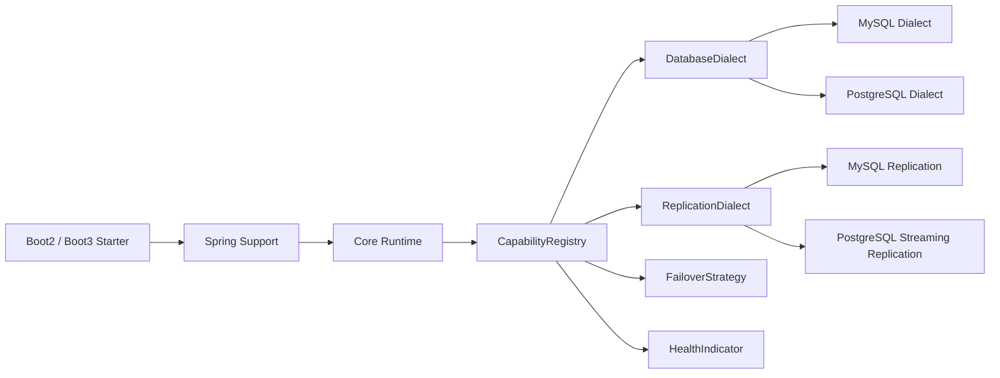

# DBGuardian PostgreSQL 支持设计方案

## 1. 背景

`DBGuardian-Spring-Boot-Starter` 当前已经拆出 `dbguardian-api`、`dbguardian-core`、`dbguardian-spring-support`、`dbguardian-boot2-starter` 等模块，`DBGuardian-Spring-Boot3-Starter` 也保留了 Boot 3 独立自动装配入口。

现有能力主要面向 MySQL：

- 读写分离：通过方法名、注解和路由数据源完成主从选择
- 故障转移：主库不可用时将从库提升为主库
- 恢复闭环：原主恢复后重新追赶并恢复主从关系
- 复制保护：依赖 MySQL GTID、`SHOW SLAVE STATUS`、`SHOW MASTER STATUS`
- 运行态同步：通过 Redis 广播主从状态、故障转移状态和恢复阶段

当前工程已经具备 PostgreSQL 支持的基础扩展点：

- `NodeModel.databaseType`
- `DbGuardianProperties.NodeProperties.databaseType`
- `DatabaseDialect`
- `CapabilityRegistry`
- `HealthIndicator`
- `FailoverStrategy`

但故障转移、复制检测、只读切换、恢复编排仍存在 MySQL 强绑定。PostgreSQL 支持不应直接在现有流程中追加大量 `if mysql / if postgresql` 分支，而应收敛到“数据库方言 + 复制操作 SPI + 版本 Starter 薄壳”的结构。

---

## 2. 目标

### 2.1 一期目标

支持 PostgreSQL 单主单从与单主多从场景，覆盖：

- Spring Boot 2.7 + Java 8 / 11
- Spring Boot 3.0 ~ 3.3 + Java 17 / 21
- MyBatis-Plus、MyBatis 优先
- JPA / Hibernate 作为后续验证项
- PostgreSQL JDBC Driver
- PostgreSQL streaming replication 的基础健康检查、复制延迟观测、读写分离、手动或半自动故障转移

### 2.2 非目标

一期不直接承诺以下能力：

- 自动执行 `pg_rewind`、`repmgr`、Patroni、pg_auto_failover 等外部高可用工具动作
- 自动修改 `postgresql.conf`、`pg_hba.conf`、replication slot
- 跨数据中心仲裁
- 多主 PostgreSQL 拓扑
- 逻辑复制拓扑自动重建

这些能力可以预留扩展点，但不应阻塞 PostgreSQL 基础读写分离与运行态接入。

---

## 3. 现状判断

### 3.1 当前模块边界

| 模块 | 当前职责 | PostgreSQL 改造判断 |
|-----|---------|--------------------|
| `dbguardian-api` | 注解、模型、SPI、运行时枚举 | 增强数据库方言和复制操作 SPI |
| `dbguardian-core` | 拓扑、路由、状态机、复制恢复判断 | 保持数据库无关，接收方言能力结果 |
| `dbguardian-spring-support` | 路由数据源、健康检查、故障转移、Redis 协调 | 抽离 MySQL SQL，改为调用方言能力 |
| `dbguardian-boot2-starter` | Boot 2 自动装配与配置绑定 | 注册 PostgreSQL 默认能力，保留 Boot 2 装配差异 |
| `DBGuardian-Spring-Boot3-Starter` | Boot 3 自动装配与配置绑定 | 注册 PostgreSQL 默认能力，保留 Boot 3 装配差异 |
| `DBGuardian-Test` | 多 Java / Boot / ORM 测试项目 | 增加 PostgreSQL 测试矩阵 |

### 3.2 当前 MySQL 绑定点

| 绑定点 | 当前表现 | PostgreSQL 替代方向 |
|-------|---------|--------------------|
| 驱动默认值 | `com.mysql.cj.jdbc.Driver` | `org.postgresql.Driver`，由 `databaseType` 或 URL 推断 |
| 健康检查 | `Connection.isValid` + MySQL 状态 SQL | `SELECT 1` + `pg_is_in_recovery()` |
| 复制状态 | `SHOW SLAVE STATUS` | `pg_stat_wal_receiver`、`pg_stat_replication` |
| GTID 位点 | `SHOW MASTER STATUS` / `Executed_Gtid_Set` | LSN：`pg_current_wal_lsn()`、`pg_last_wal_replay_lsn()` |
| 延迟判断 | `Seconds_Behind_Master` | `now() - pg_last_xact_replay_timestamp()` 或 LSN 差值 |
| 只读开关 | `SET GLOBAL READ_ONLY` / `SUPER_READ_ONLY` | 不直接全局切换，使用角色权限、事务只读或外部 HA 工具控制 |
| 升主动作 | `STOP SLAVE`、`RESET SLAVE`、`START SLAVE` | `pg_promote()`，重建复制交给策略实现或外部工具 |
| URL 解析 | `jdbc:mysql://` 固定替换 | 通用 JDBC URL 解析器，按方言默认端口处理 |

---

## 4. 总体设计

### 4.1 架构目标

PostgreSQL 支持按下面结构接入：



核心原则：

- Spring Boot 版本只影响装配，不影响 PostgreSQL 行为语义
- 数据库差异进入方言与复制操作层，不进入路由主流程
- MySQL 既有能力保留，PostgreSQL 作为第二个标准方言接入
- 一期 PostgreSQL 允许“可观测 + 可路由 + 可升主”，复制重建按策略拆分

### 4.2 推荐新增模块

优先采用独立方言模块：

```text
DBGuardian-Spring-Boot-Starter/
├── dbguardian-dialect-mysql
├── dbguardian-dialect-postgresql
└── dbguardian-spring-support
```

如果短期不想调整 Maven 多模块结构，也可以先放在：

```text
dbguardian-spring-support/src/main/java/io/dbguardian/spring/dialect/postgresql
```

但长期建议独立模块，原因是数据库驱动、复制策略、SQL 差异会持续扩张。

---

## 5. 配置设计

### 5.1 保留当前兼容入口

当前 README 和测试项目使用：

```yaml
spring:
  datasource:
    master:
      url: jdbc:mysql://localhost:3306/test
    slave:
      url: jdbc:mysql://localhost:3306/test
```

PostgreSQL 一期应支持同样结构，只替换驱动和 URL：

```yaml
spring:
  datasource:
    master:
      url: jdbc:postgresql://pg-master:5432/app
      username: app
      password: secret
      driver-class-name: org.postgresql.Driver
    slave:
      url: jdbc:postgresql://pg-slave:5432/app
      username: app
      password: secret
      driver-class-name: org.postgresql.Driver
    replication:
      master-host: pg-master
      master-port: 5432
      master-user: replicator
      master-password: repl_secret
    allow-degraded-startup: true
```

### 5.2 标准化 `dbguardian.nodes` 入口

推荐 PostgreSQL 新增用法优先走统一拓扑配置：

```yaml
dbguardian:
  enabled: true
  cluster-id: pg-demo
  nodes:
    - id: pg-master
      role: master
      database-type: postgresql
      jdbc-url: jdbc:postgresql://pg-master:5432/app
      username: app
      password: secret
      priority: 100
      tags:
        - zone-a
    - id: pg-slave-1
      role: slave
      database-type: postgresql
      jdbc-url: jdbc:postgresql://pg-slave-1:5432/app
      username: app
      password: secret
      master-ref: pg-master
      weight: 100
      tags:
        - zone-a
```

### 5.3 新增数据库能力配置

建议新增 `dbguardian.database` 与 `dbguardian.replication` 的标准语义：

```yaml
dbguardian:
  database:
    type: postgresql
    health-check-sql: SELECT 1
    auto-detect-from-url: true
  replication:
    mode: streaming
    lag-threshold-ms: 5000
    promotion:
      enabled: true
      mode: builtin
    recovery:
      mode: manual
```

字段含义：

| 字段 | 含义 | PostgreSQL 一期建议 |
|-----|------|-------------------|
| `database.type` | 数据库类型 | `mysql` / `postgresql` |
| `database.auto-detect-from-url` | 未显式配置时从 JDBC URL 推断 | 默认开启 |
| `replication.mode` | 复制模式 | `streaming` |
| `replication.lag-threshold-ms` | 从库读流量最大可接受延迟 | 默认 `5000` |
| `replication.promotion.enabled` | 是否允许 DBGuardian 执行升主 | 默认关闭或测试环境开启 |
| `replication.promotion.mode` | 升主方式 | `builtin` / `external` / `manual` |
| `replication.recovery.mode` | 原主恢复方式 | 一期默认 `manual` |

---

## 6. SPI 扩展设计

### 6.1 扩展 `DatabaseDialect`

当前 `DatabaseDialect` 只包含名称、数据库类型和健康检查 SQL，不足以承载 PostgreSQL 行为差异。

建议扩展为：

```text
DatabaseDialect
├── databaseType
├── driverClassName
├── defaultPort
├── healthCheckSql
├── readOnlyProbeSql
├── currentPositionSql
├── replayPositionSql
├── replicationLagSql
└── urlParser
```

PostgreSQL 默认能力：

| 能力 | SQL / 行为 |
|-----|------------|
| 健康检查 | `SELECT 1` |
| 是否恢复中 | `SELECT pg_is_in_recovery()` |
| 主库当前 LSN | `SELECT pg_current_wal_lsn()` |
| 从库回放 LSN | `SELECT pg_last_wal_replay_lsn()` |
| 从库延迟 | `SELECT EXTRACT(EPOCH FROM now() - pg_last_xact_replay_timestamp())` |
| 升主 | `SELECT pg_promote()` |
| 默认端口 | `5432` |

### 6.2 新增 `ReplicationDialect`

数据库复制不应塞进 `DatabaseDialect`。建议新增复制操作 SPI：

```text
ReplicationDialect
├── databaseType
├── getCurrentPosition(node)
├── getReplayPosition(node)
├── getReplicationLag(node)
├── isReplicationHealthy(node)
├── promote(node)
├── demote(node)
├── rebuildReplication(source, target)
└── comparePosition(primaryPosition, secondaryPosition)
```

PostgreSQL 一期策略：

| 操作 | 一期实现 |
|-----|---------|
| `getCurrentPosition` | 主库执行 `pg_current_wal_lsn()` |
| `getReplayPosition` | 从库执行 `pg_last_wal_replay_lsn()` |
| `getReplicationLag` | 基于 `pg_last_xact_replay_timestamp()` |
| `isReplicationHealthy` | 从库存在 WAL receiver 或延迟低于阈值 |
| `promote` | 可选执行 `pg_promote()` |
| `demote` | 默认不自动执行 |
| `rebuildReplication` | 默认返回 `MANUAL_REQUIRED` |
| `comparePosition` | 使用 `pg_wal_lsn_diff()` 或本地 LSN 解析比较 |

### 6.3 新增复制操作结果模型

建议复制动作返回结构化结果，避免只靠异常和日志判断：

```text
ReplicationActionResult
├── action
├── success
├── nodeId
├── reason
├── manualRequired
├── observedPosition
└── message
```

这样 MySQL、PostgreSQL、未来国产数据库都能统一表达：

- 已完成
- 已跳过
- 需要人工处理
- 外部 HA 工具接管
- 当前状态不可判定

---

## 7. 运行态流程设计

### 7.1 启动识别流程

```text
读取配置
  ↓
生成 ClusterModel
  ↓
按 node.databaseType / jdbcUrl 选择 DatabaseDialect
  ↓
注册 DataSourceWrapper
  ↓
执行方言健康检查
  ↓
识别 master / slave 运行态
  ↓
进入 MASTER_ACTIVE / DEGRADED / SLAVE_PROMOTED
```

### 7.2 PostgreSQL 健康检查

主库检查：

```text
连接可用
  + SELECT 1 成功
  + pg_is_in_recovery() = false
```

从库检查：

```text
连接可用
  + SELECT 1 成功
  + pg_is_in_recovery() = true
  + 复制延迟 <= lag-threshold-ms
```

注意：如果某个 PostgreSQL 从库已经被提升，它的 `pg_is_in_recovery()` 会变成 `false`。此时不应再把它当作只读从库，而应根据运行态标记为 promoted master。

### 7.3 PostgreSQL 读写路由

读写路由主流程不需要变：

```text
写操作 / @ForceMaster
  → activeMaster

读操作 / @ReadOnlyConnection
  → availableSlaves
  → 过滤 replicationHealthy = true
  → 按现有负载均衡策略选择

无可用从库
  → fallbackToMaster=true 时走主库
  → fallbackToMaster=false 时抛出不可用异常
```

### 7.4 PostgreSQL 故障转移

一期推荐三档模式：

| 模式 | 说明 | 适用场景 |
|-----|------|---------|
| `manual` | DBGuardian 只标记状态并停止写入推荐，不执行升主 | 生产默认 |
| `builtin` | DBGuardian 执行 `SELECT pg_promote()` | 测试、小规模可控环境 |
| `external` | DBGuardian 观察 Patroni / repmgr 等外部工具结果 | 生产推荐 |

`builtin` 模式流程：

```text
主库健康检查失败
  ↓
Redis 获取故障转移锁
  ↓
选择复制延迟最低、健康状态最佳的从库
  ↓
执行 SELECT pg_promote()
  ↓
确认 pg_is_in_recovery() = false
  ↓
运行态标记 SLAVE_PROMOTED
  ↓
读写流量切到新主
  ↓
广播状态到 Redis
```

### 7.5 PostgreSQL 原主恢复

一期不建议自动恢复原主为主库。推荐状态流：

```text
原主恢复可连接
  ↓
标记 RECOVERING_ORIGINAL_MASTER
  ↓
检查是否仍为旧数据目录 / 是否可能脑裂
  ↓
返回 MANUAL_REQUIRED
  ↓
由外部流程完成 pg_rewind / basebackup / replication slot 重建
  ↓
DBGuardian 重新观测为 healthy slave
  ↓
恢复 MASTER_ACTIVE
```

这样可以避免在生产环境中误操作 PostgreSQL 数据目录。

---

## 8. 对现有代码的改造范围

### 8.1 `dbguardian-api`

建议调整：

- 扩展 `DatabaseDialect`
- 新增 `ReplicationDialect`
- 新增 `ReplicationActionResult`
- 新增标准数据库类型常量：`mysql`、`postgresql`
- `NodeModel` 保持 `databaseType`，无需破坏性改动

### 8.2 `dbguardian-core`

建议调整：

- `CapabilityRegistry` 增加复制方言注册与按 `databaseType` 查询能力
- `ReplicationRecoveryCoordinator` 不直接理解 MySQL GTID，只处理标准状态与复制动作结果
- `GtidConsistencyInspector` 改名或补充为 `ReplicationConsistencyInspector`
- MySQL GTID 逻辑下沉到 MySQL 复制方言
- 新增 PostgreSQL LSN 比较能力

### 8.3 `dbguardian-spring-support`

建议调整：

- `DataSourceHealthChecker` 不再直接执行 `SHOW SLAVE STATUS`
- `FailoverController` 不再直接执行 `CHANGE MASTER TO`、`START SLAVE`、`SET GLOBAL READ_ONLY`
- `DbGuardianRuntimeOrchestrator` 不再直接解析 `jdbc:mysql://`
- URL 解析、默认端口、复制状态读取交给对应方言
- 只保留运行态推进、锁、事件广播和负载池更新

### 8.4 Boot 2 Starter

建议调整：

- 默认注册 MySQL 方言
- 检测 PostgreSQL driver 存在时注册 PostgreSQL 方言
- `SpringDataSourceProperties.NodeProperties.driverClassName` 默认值不再固定为 MySQL
- 如果用户未配置 `driver-class-name`，按 JDBC URL 推断
- 保留 `spring.redis` 配置入口

### 8.5 Boot 3 Starter

建议调整：

- 与 Boot 2 使用同一套方言与核心能力
- 自动配置入口保留 `AutoConfiguration.imports`
- Redis 使用 `spring.data.redis`
- `jakarta` / `javax` 差异只留在 Boot 3 壳层

---

## 9. PostgreSQL 方言行为细节

### 9.1 节点角色判定

| 查询结果 | 运行态含义 |
|---------|------------|
| `pg_is_in_recovery() = false` 且配置为 master | 正常主库 |
| `pg_is_in_recovery() = true` 且配置为 slave | 正常从库 |
| `pg_is_in_recovery() = false` 且配置为 slave | 可能已升主，需要进入 `SLAVE_PROMOTED` 或等待外部确认 |
| `pg_is_in_recovery() = true` 且配置为 master | 原主可能已被重建为从库，需要进入恢复观测 |

### 9.2 延迟计算优先级

优先级建议：

1. 从库执行 `now() - pg_last_xact_replay_timestamp()`
2. 主从同时可访问时，用 `pg_wal_lsn_diff(master_lsn, replay_lsn)` 估算 WAL 字节差
3. 无法获取复制指标时，只保留连接健康，不进入读池

### 9.3 升主候选选择

候选排序：

```text
健康从库
  ↓
复制延迟最低
  ↓
LSN 最新
  ↓
priority 最高
  ↓
weight 最高
  ↓
配置顺序
```

这比单纯按 `priority` 更适合 PostgreSQL，因为复制延迟和 WAL 回放位置直接影响数据丢失窗口。

### 9.4 读池准入规则

从库进入读池必须满足：

```text
连接健康
  + pg_is_in_recovery() = true
  + 延迟在阈值内
  + 当前节点未处于 recovery / contamination / manual_required 状态
```

如果延迟超阈值，应只从读池移除，不应直接触发故障转移。

---

## 10. 依赖设计

### 10.1 PostgreSQL JDBC

Starter 不建议强制依赖 PostgreSQL Driver，避免污染 MySQL 用户依赖树。

推荐用户项目显式添加：

```xml
<dependency>
    <groupId>org.postgresql</groupId>
    <artifactId>postgresql</artifactId>
    <scope>runtime</scope>
</dependency>
```

如果需要提供方言模块，可设置为 optional：

```xml
<dependency>
    <groupId>org.postgresql</groupId>
    <artifactId>postgresql</artifactId>
    <optional>true</optional>
</dependency>
```

### 10.2 测试容器

集成测试建议引入 Testcontainers PostgreSQL：

```xml
<dependency>
    <groupId>org.testcontainers</groupId>
    <artifactId>postgresql</artifactId>
    <scope>test</scope>
</dependency>
```

---

## 11. 测试方案

### 11.1 新增测试项目

结合 `DBGuardian-Test` 现有规划，建议先补齐以下项目：

| 项目 | Java | Spring Boot | ORM | 数据库 | 优先级 |
|-----|------|-------------|-----|--------|-------|
| `dbguardian-test-java8-sb27-mbp-pg` | 8 | 2.7 | MyBatis-Plus | PostgreSQL | P0 |
| `dbguardian-test-java11-sb27-mbp-pg` | 11 | 2.7 | MyBatis-Plus | PostgreSQL | P1 |
| `dbguardian-test-java17-sb32-mybatis-pg` | 17 | 3.2 | MyBatis | PostgreSQL | P0 |
| `dbguardian-test-java17-sb32-jpa-pg` | 17 | 3.2 | JPA | PostgreSQL | P1 |
| `dbguardian-test-java21-sb33-mbp-pg` | 21 | 3.3 | MyBatis-Plus | PostgreSQL | P1 |

### 11.2 用例矩阵

| 用例 | 验证点 | 期望结果 |
|-----|--------|---------|
| 单主单从启动 | PostgreSQL URL、驱动、方言识别 | 应用正常启动，主从状态正确 |
| 读写分离 | 查询走从库，写入走主库 | 路由符合预期 |
| 从库延迟超阈值 | 读池剔除 | 读请求 fallback 或失败，按配置决定 |
| 从库恢复 | 重新进入读池 | 状态恢复为可读 |
| 主库故障 manual 模式 | 不执行升主 | 状态进入 DEGRADED / MANUAL_REQUIRED |
| 主库故障 builtin 模式 | 执行 `pg_promote()` | 从库提升为 active master |
| 外部升主观察 | 外部完成升主后 DBGuardian 识别 | 状态进入 SLAVE_PROMOTED |
| 原主恢复 | 不自动改写数据目录 | 标记恢复需要人工处理 |
| Boot 2 Redis 同步 | `spring.redis` | 状态广播正常 |
| Boot 3 Redis 同步 | `spring.data.redis` | 状态广播正常 |

### 11.3 测试数据结构

PostgreSQL 测试表避免 MySQL 方言特性：

```sql
CREATE TABLE users (
    id BIGSERIAL PRIMARY KEY,
    username VARCHAR(64) NOT NULL,
    email VARCHAR(128),
    created_at TIMESTAMP DEFAULT CURRENT_TIMESTAMP
);
```

MyBatis-Plus 场景要注意：

- 主键策略从 MySQL 自增切换为 PostgreSQL `BIGSERIAL` 或 identity
- SQL 不使用反引号
- 分页由框架 PostgreSQL 方言处理

---

## 12. 实施顺序

### 阶段一：基础方言接入

- 扩展 `DatabaseDialect`
- 新增 PostgreSQL 方言
- 配置驱动自动推断
- 健康检查 SQL 方言化
- URL host / port 解析通用化

交付结果：PostgreSQL 单主单从可以启动，读写路由可用。

### 阶段二：复制观测接入

- 新增 `ReplicationDialect`
- PostgreSQL LSN、延迟、恢复状态观测
- 从库读池准入按延迟过滤
- 复制状态进入 `NodeRuntimeState`

交付结果：PostgreSQL 从库健康、延迟、读池准入可控。

### 阶段三：故障转移接入

- PostgreSQL `manual`、`builtin`、`external` 三种 promotion 模式
- `pg_promote()` 能力受配置开关保护
- 故障转移锁与 Redis 状态同步复用现有流程
- 原主恢复默认返回 `MANUAL_REQUIRED`

交付结果：测试环境可自动升主，生产环境可安全观测外部 HA 工具结果。

### 阶段四：测试矩阵补齐

- 增加 PostgreSQL 测试项目
- 增加 PostgreSQL schema
- 增加 Boot 2 / Boot 3 集成测试
- 增加 MyBatis-Plus / MyBatis / JPA 验证

交付结果：PostgreSQL 支持进入稳定回归范围。

---

## 13. 风险与约束

| 风险 | 说明 | 处理方式 |
|-----|------|---------|
| PostgreSQL 原主恢复复杂 | 涉及数据目录、WAL、timeline、slot | 一期只观测，不自动恢复 |
| `pg_promote()` 权限要求 | 应用账号通常没有升主权限 | 默认 `manual`，测试环境显式开启 |
| 脑裂风险 | 原主恢复后可能仍可写 | 恢复阶段默认人工确认 |
| 复制延迟指标为空 | 从库无回放事务时 timestamp 可能为空 | 使用 LSN 差值兜底 |
| 多 HA 工具并存 | Patroni / repmgr / pg_auto_failover 行为不同 | 通过 `external` 模式观察结果，不抢控制权 |
| Boot 2 / Boot 3 配置差异 | Redis 配置路径不同 | 仅在 starter 壳层处理 |

---

## 14. 结论

PostgreSQL 支持的关键不是替换 JDBC URL，而是把当前 MySQL 强绑定的复制状态、只读控制、GTID 判断和故障转移动作抽象为数据库方言能力。

推荐路线：

```text
先方言化健康检查和 URL 解析
  → 再接入 PostgreSQL LSN / 延迟观测
  → 再开放受保护的 pg_promote()
  → 最后补齐测试矩阵和外部 HA 工具观察模式
```

这样可以在不破坏现有 MySQL 能力的前提下，让 `DBGuardian-Spring-Boot-Starter` 和 `DBGuardian-Spring-Boot3-Starter` 同时支持 PostgreSQL，并为后续 Oracle、SQL Server、国产数据库适配保留统一扩展路径。