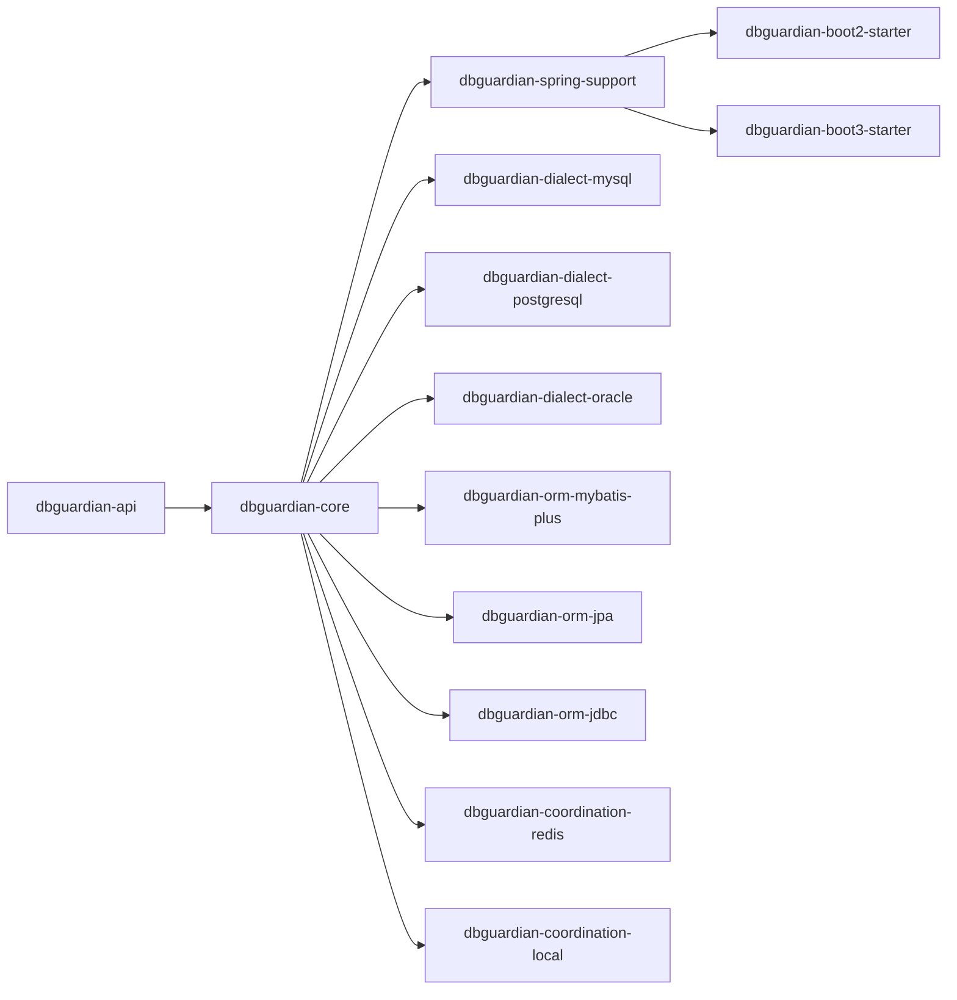

# DBGuardian 多版本兼容与可扩展设计方案

## 1. 背景

当前 `io.dbguardian` 已经具备读写分离、负载均衡、故障转移、Redis 协调等能力，但工程形态还是单体 starter。

现状的主要特征：

- 自动配置、运行时状态、连接池创建、故障转移、协调逻辑耦合在同一入口里
- Spring Boot 版本差异直接影响自动装配实现
- JDK 版本差异直接影响整体编译和发布
- ORM、数据库、路由策略的扩展需要改主流程

这会导致后续每新增一个 Spring Boot 版本、JDK 版本、数据库类型或 ORM 框架，都要在现有核心实现里补分支，维护成本会持续上升。

本方案目标是把 DBGuardian 设计成：

- 一套稳定核心能力
- 多个薄适配层
- 一组插件化扩展模块

这样后续扩展时，主要动作会变成“新增模块 / 新增实现 / 新增注册”，而不是“逐个修改旧逻辑”。

---

## 2. 当前问题判断

结合当前工程，兼容性和扩展性的问题主要集中在以下几个方面。

### 2.1 单体 starter 结构过重

当前 starter 入口承载了过多职责：

- 配置读取
- Hikari 数据源创建
- 路由数据源组装
- 健康检查
- 故障转移
- Redis 协调
- 生命周期管理
- 启动校验

这意味着任何一个维度变化，都会影响整个自动配置主类。

### 2.2 Spring Boot 版本差异直接暴露在主实现里

目前自动装配入口仍然基于 Spring Boot 2 的方式。

直接影响点包括：

- 自动配置入口元数据
- 条件装配机制
- `javax.*` 与 `jakarta.*` 命名空间差异
- Spring Boot 3 对 JDK 基线的要求

如果继续把 Boot 2 和 Boot 3 强放在同一个 starter 源码目录里，后面会持续出现兼容性分支和测试膨胀。

### 2.3 配置模型不收敛

当前存在两套配置入口：

- `spring.datasource.*`
- `spring.datasource.dbguardian.*`

这会导致：

- 语义重复
- 配置职责不清
- 后续拓扑扩展时继续叠新配置类

### 2.4 ORM 识别方式过于硬编码

当前路由切面偏向 MyBatis-Plus 的直接识别方式。

这会让后续支持以下技术栈时都需要继续改主逻辑：

- JPA / Hibernate
- 原生 JDBC
- MyBatis
- 自定义 Repository
- 未来新的 ORM 接入方式

### 2.5 数据库差异还没有彻底抽象

不同数据库在以下方面天然不同：

- 驱动类名
- 健康检查 SQL
- 分页语法
- 只读切换方式
- 主从复制命令
- 故障切换时的恢复动作

如果这些差异继续混在主流程里，数据库适配会越来越重。

---

## 3. 目标设计

### 3.1 总体目标

把工程升级为“稳定内核 + 薄适配层 + 插件扩展层”。

### 3.2 目标结果

最终希望达到下面几件事：

- Spring Boot 版本变化时，只调整对应 starter 壳层
- JDK 版本变化时，不拖动核心模块整体重编
- 新增数据库时，通过新增方言模块接入
- 新增 ORM 时，通过新增集成模块接入
- 新增路由策略时，通过新增策略实现接入
- 新增协调方式时，通过新增协调驱动接入

---

## 4. 设计原则

### 4.1 核心层不感知 Spring Boot 版本

`dbguardian-core` 只保留稳定业务概念：

- 拓扑模型
- 路由上下文
- 节点状态机
- 故障转移编排
- 健康检查抽象
- 能力注册表
- 事件模型

Spring Boot 2 和 Spring Boot 3 的差异，不应该进入核心决策逻辑。

### 4.2 版本差异只留在适配层

版本差异只应该存在于：

- 自动配置入口
- 容器装配方式
- 注解和命名空间适配
- 框架依赖版本

业务模型、状态流转、路由流程都不应该因为 Boot 版本变化而重写。

### 4.3 功能扩展必须走 SPI

后续新增能力时，原则上不改主流程，只增加实现。

SPI 是整个架构长期可维护的关键。

### 4.4 配置只保留一套标准语义

所有配置最终都应该收敛为一棵统一配置树，避免双入口长期并存。

### 4.5 默认实现可替换

每个扩展点都需要有：

- 默认实现
- 可覆盖实现
- 明确优先级
- 条件激活方式

这样用户要做自定义时，不需要 fork 主干。

---

## 5. 推荐模块拆分

## 5.1 `dbguardian-api`

职责：对外稳定接口层。

建议包含：

- 对外注解
  - `@EnableDbGuardian`
  - `@ForceMaster`
  - `@ReadOnlyConnection`
- 配置模型 DTO
- SPI 接口定义
- 事件模型
- 标准枚举

这个模块尽量稳定，尽量少依赖 Spring 细节。

## 5.2 `dbguardian-core`

职责：承载真正的业务内核。

建议包含：

- `ClusterModel`
- `NodeModel`
- `RoutingContext`
- `RoutingEngine`
- `CapabilityRegistry`
- `FailoverOrchestrator`
- `HealthStateMachine`
- `TopologySnapshot`
- `EventPublisher` 抽象

这里不直接关心 Spring Boot 2 / 3，只处理标准输入和标准输出。

## 5.3 `dbguardian-spring-support`

职责：把核心层桥接到 Spring 体系。

建议包含：

- 路由上下文存储
- Spring 事务读写感知
- 通用动态数据源外壳
- Spring Bean 装配基类
- Spring 生命周期桥接
- Spring 事件桥接

这个模块是 Spring 相关能力的公共层，Boot 2/3 都依赖它。

## 5.4 `dbguardian-boot2-starter`

职责：适配 Spring Boot 2。

建议包含：

- Boot 2 自动配置
- `spring.factories`
- `javax.*` 相关适配
- 面向 Java 8+ 的发布基线

## 5.5 `dbguardian-boot3-starter`

职责：适配 Spring Boot 3。

建议包含：

- Boot 3 自动配置
- `AutoConfiguration.imports`
- `jakarta.*` 相关适配
- 面向 Java 17+ 的发布基线

## 5.6 可选插件模块

建议首批插件：

- `dbguardian-dialect-mysql`
- `dbguardian-dialect-postgresql`
- `dbguardian-dialect-oracle`
- `dbguardian-orm-mybatis-plus`
- `dbguardian-orm-jpa`
- `dbguardian-orm-jdbc`
- `dbguardian-coordination-redis`
- `dbguardian-coordination-local`

后续扩展只需要继续横向增加模块，不改主干目录结构。

---

## 6. 核心抽象设计

## 6.1 拓扑模型

不要再把结构写死成单独的 master/slave 两套字段，而是统一成标准拓扑模型。

建议脑模型：

- cluster
  - group
    - node

每个 `node` 描述统一元数据：

- `id`
- `role`
- `databaseType`
- `jdbcProfile`
- `weight`
- `priority`
- `masterRef`
- `tags`
- `enabled`
- `healthState`
- `capabilities`

这样同一套模型可以覆盖：

- 单主单从
- 单主多从
- 多主多从
- 双主双从
- 分片
- 特殊拓扑扩展

## 6.2 路由上下文

建议把路由决策输入统一成一个上下文对象。

上下文字段建议包括：

- 操作类型：读 / 写
- 是否强制主库
- 是否事务内调用
- 事务是否只读
- ORM 类型
- 方法签名信息
- 分片键
- 租户信息
- 调用来源标签

这样后续不管是注解路由、事务路由、分片路由还是 ORM 识别，最终都通过同一对象进入路由引擎。

## 6.3 能力注册表

建议建立统一的能力注册中心 `CapabilityRegistry`。

注册内容建议包括：

- 数据库方言
- 读写分类器
- 路由策略
- 故障转移策略
- 协调器驱动
- ORM 集成器
- 健康检查器

能力注册表的作用：

- 主流程不关心具体实现类
- 新扩展以注册方式加入
- 默认实现与自定义实现可以并存

## 6.4 事件模型

建议把内部关键过程事件化。

建议事件包括：

- `NodeDownDetected`
- `NodeRecovered`
- `FailoverStarted`
- `PrimaryPromoted`
- `TopologyChanged`
- `RoutingDecisionGenerated`

这样未来加监控、审计、运维通知、管理台展示时，不需要改故障转移核心链路。

---

## 7. SPI 设计建议

## 7.1 `DatabaseDialect`

职责：承接数据库差异。

建议覆盖范围：

- 驱动信息
- 健康检查 SQL
- 只读开关动作
- 主从复制管理动作
- 故障恢复动作
- 分页语法描述

演进方式：

- 新数据库支持 = 新增一个方言实现
- 主流程只按 `databaseType` 找对应方言

## 7.2 `ReadWriteClassifier`

职责：判断当前请求应当走读链路还是写链路。

建议采用分类器链：

1. 显式注解分类器
2. 事务属性分类器
3. ORM 语义分类器
4. 方法名兜底分类器
5. 默认写库

这样不会把所有识别逻辑塞进一个切面类里。

## 7.3 `RoutingPolicy`

职责：基于上下文和可用节点列表给出目标节点。

建议支持：

- 轮询
- 加权轮询
- 随机
- 加权随机
- 最少连接
- 一致性哈希
- 主库优先
- 广播写入

新增路由策略时，只需要新增策略实现并注册。

## 7.4 `CoordinationDriver`

职责：处理多实例间状态同步。

建议首批支持：

- 本地单机协调
- Redis 协调

未来可以继续扩：

- ZooKeeper
- Nacos
- Etcd

## 7.5 `OrmIntegration`

职责：抽象 ORM 层语义接入。

建议支持：

- MyBatis-Plus
- MyBatis
- JPA / Hibernate
- Spring JDBC

ORM 集成层主要负责：

- 识别操作类型
- 提取上下文
- 补充分片键 / 方法元数据

---

## 8. 配置模型重构建议

建议把现有配置统一收敛为一套标准树。

建议结构：

- `dbguardian.enabled`
- `dbguardian.topology`
- `dbguardian.nodes`
- `dbguardian.routing`
- `dbguardian.failover`
- `dbguardian.coordination`
- `dbguardian.integrations`

### 8.1 配置分区含义

- `enabled`
  - 是否启用 DBGuardian
- `topology`
  - 当前集群模式和拓扑分组
- `nodes`
  - 所有节点定义
- `routing`
  - 读写分类、负载策略、分片策略
- `failover`
  - 健康检查、故障阈值、提升策略、恢复策略
- `coordination`
  - 协调器类型、实例名、通道配置
- `integrations`
  - ORM、方言、扩展能力开关

### 8.2 重构收益

统一后会直接得到这些好处：

- 配置语义清晰
- 拓扑可扩展
- 老配置迁移路径明确
- 文档和样例可复用
- 不需要继续新增平行配置类

---

## 9. 多 Spring Boot / JDK 兼容策略

## 9.1 Spring Boot 兼容策略

### Boot 2

保留独立 starter：

- 使用 `spring.factories`
- 适配 `javax.*`
- Java 8+ 基线

### Boot 3

独立 starter：

- 使用 `AutoConfiguration.imports`
- 适配 `jakarta.*`
- Java 17+ 基线

### 不建议的方案

不建议继续用一个 starter 同时承载 Boot 2 和 Boot 3 的全部源码差异。

原因很直接：

- 命名空间差异不可避免
- 自动配置元数据格式不同
- 依赖基线不同
- 测试矩阵会明显膨胀

正确方式是：

- 核心一份
- 适配壳层两份
- 插件模块按需共用

## 9.2 JDK 兼容策略

建议采用“最低基线 + 分版本产物”。

建议基线：

- `dbguardian-core`：Java 8
- `dbguardian-boot2-starter`：Java 8
- `dbguardian-boot3-starter`：Java 17

代码约束建议：

- 核心层禁止使用高版本语法特性
- 高版本优化单独模块化
- 避免让核心逻辑依赖只在高版本存在的 API

这样可以保证核心层长期稳定，不会因为高版本优化破坏低版本兼容。

---

## 10. 自动配置重构建议

当前自动配置类建议拆成更清晰的职责边界。

推荐拆分为以下对象：

- `DbGuardianPropertiesBinder`
  - 把配置树转成标准 `ClusterModel`
- `DataSourceFactory`
  - 负责创建标准数据源对象
- `RoutingEngine`
  - 负责路由决策
- `FailoverOrchestrator`
  - 负责故障切换流程编排
- `CoordinationBootstrap`
  - 负责协调器初始化
- `DbGuardianLifecycleManager`
  - 负责启动、停止、恢复、资源关闭
- `Boot2AutoConfiguration` / `Boot3AutoConfiguration`
  - 只负责装配

重构后的自动配置类只做四件事：

- 发现依赖
- 绑定配置
- 注册默认 Bean
- 组装核心对象

这样自动配置层会变薄，后续改动的影响面也会变小。

---

## 11. 后续扩展时不需要逐个修改的关键机制

## 11.1 能力注册机制

所有可变点统一注册化：

- 数据库方言按 `dbType` 注册
- ORM 集成按 `integrationType` 注册
- 路由策略按 `strategyName` 注册
- 协调器按 `coordinationType` 注册

新增功能时只做：

- 新增实现
- 注册到能力中心

主流程不改。

## 11.2 标准事件总线

核心流程通过事件协作，而不是对象互相硬编码调用。

这样：

- 指标采集可以旁路监听
- 审计日志可以旁路监听
- 管理台可以旁路订阅
- 通知告警可以旁路扩展

## 11.3 默认实现 + 覆盖式装配

每个 SPI 都提供默认实现。

用户如果要自定义：

- 提供自己的实现
- 替换默认实现
- 不需要改 DBGuardian 源码

## 11.4 标准化测试矩阵

兼容能力不能靠口头声明，必须靠测试矩阵固化。

建议至少覆盖：

- JDK 8 + Boot 2.7
- JDK 11 + Boot 2.7
- JDK 17 + Boot 2.7
- JDK 17 + Boot 3.x
- JDK 21 + Boot 3.x

每个组合至少验证：

- 自动装配成功
- 路由选择正确
- 事务场景下读写选择正确
- 故障转移可以稳定跑通
- 插件能力可以正常加载

---

## 12. 推荐实施路径

### 第 1 阶段：先去耦

目标：不先追求全量兼容，先把大类拆开。

建议动作：

- 从自动配置类中抽出运行时职责
- 统一配置树
- 建立标准拓扑模型
- 建立分类器链
- 抽出数据库方言接口

### 第 2 阶段：拆模块

目标：建立长期稳定发布结构。

建议动作：

- 建 parent 聚合工程
- 拆出 `api/core/spring-support/boot2/boot3/plugins`
- 收紧依赖方向
- 把现有 MySQL、Redis、MyBatis-Plus 变成默认插件

### 第 3 阶段：补兼容矩阵

目标：让兼容性可验证。

建议动作：

- 按 JDK / Boot / ORM / 数据库建立测试样例
- 用统一黑盒用例跑通路由、事务、故障切换
- 把兼容结果固化成发布前检查项

---

## 13. 最小可行落地方案

如果希望控制改造成本，建议优先落地这一版：

- 保留一个 `core`
- 保留一个 `boot2-starter`
- 新增一个 `boot3-starter`
- 引入 `DatabaseDialect` SPI
- 引入 `ReadWriteClassifier` SPI
- 引入 `CoordinationDriver` SPI
- 把 MySQL / Redis / MyBatis-Plus 先改造成默认插件

这版可以先解决最主要的维护问题：

- Spring Boot 版本差异拆开
- JDK 基线清晰
- ORM 扩展不再改主流程
- 数据库扩展不再改主流程
- 协调能力扩展不再改主流程

---

## 14. 结论

DBGuardian 后续要同时匹配多个 Spring Boot 版本和多个 JDK 版本，正确方向不是继续扩大单体 starter，而是尽快切换到：

- 低基线稳定核心
- 多 starter 薄适配层
- 全部变化点 SPI 化
- 测试矩阵固化兼容能力

这样未来新增版本、新数据库、新 ORM、新路由策略时，工程动作会变成：

- 新增模块
- 新增实现
- 新增注册

而不是继续进入现有主类逐个加分支。

---

## 15. 建议的下一步

建议按以下顺序推进：

1. 先拆 `DbGuardianAutoConfiguration` 的职责边界
2. 再统一配置模型到 `dbguardian.*`
3. 再引入 SPI 和能力注册表
4. 然后拆 Boot 2 / Boot 3 starter
5. 最后补齐兼容测试矩阵

这条顺序的好处是：

- 先把耦合降下来
- 再做模块发布拆分
- 最后再扩大兼容面

改造风险最低，也最适合逐步推进。